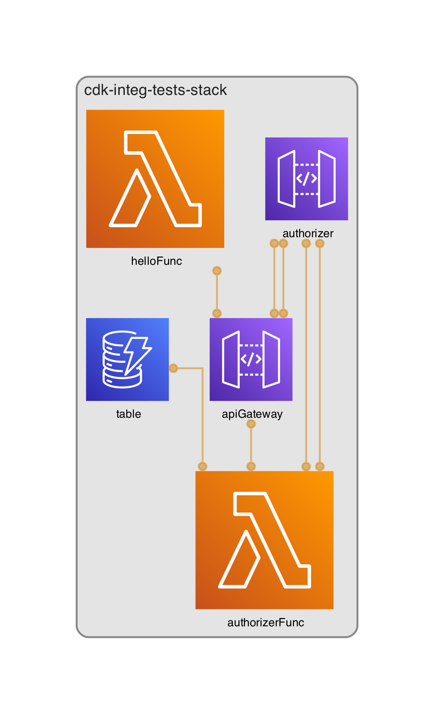

CDK for Pythonでインテグレーションテストをするサンプル

# 構成



構成の出力には https://github.com/pistazie/cdk-dia を使わせて頂いてます！感謝！

# 準備

```
npm install
pip install -r requirements.txt
```

# デプロイ

```
npx cdk -a "python3 app.py" deploy
```

# インテグレーションテスト

pythonのinteg-runnerでは[インテグレーションテストとプロジェクトでディレクトリがずれる問題](https://github.com/aws/aws-cdk/issues/29196)があるためパスの修正のため[cdk-integ-runner-cwd-fix](https://github.com/tomharvey/cdk-integ-runner-cwd-fix)を使わせてもらっています。その関係でテスト時に`CDK_INTEG_RUNNER_CWD`を設定しています。

```
CDK_INTEG_RUNNER_CWD=$(PWD) && npx integ-runner
```
